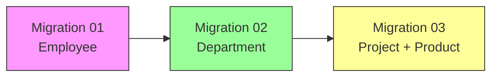
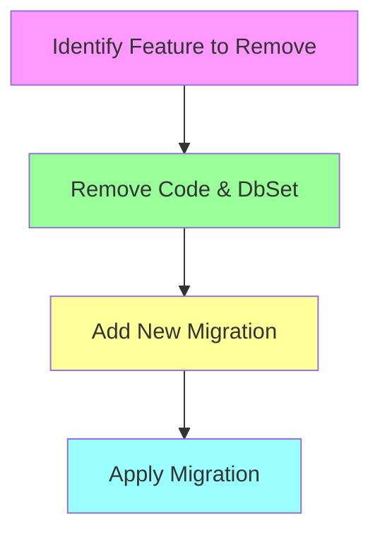
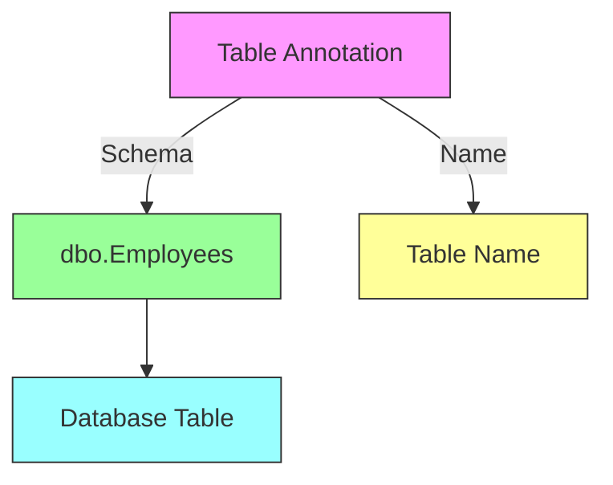
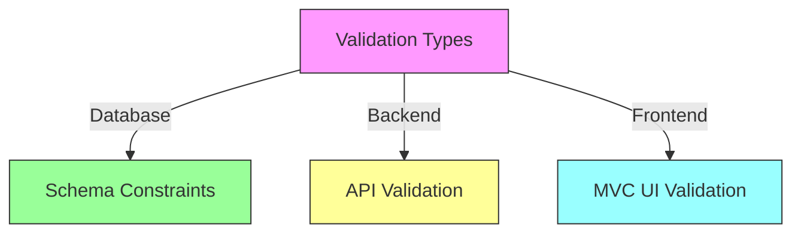
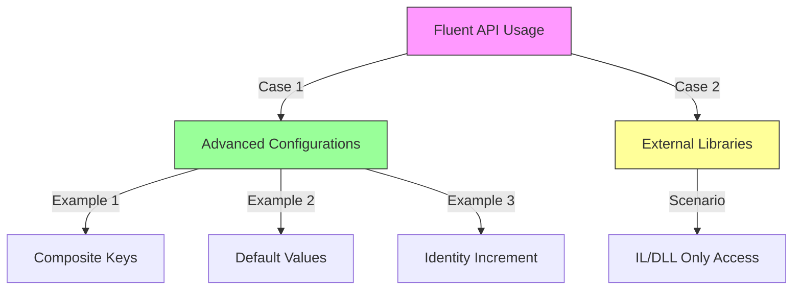

# Understanding Entity Framework Core Migrations

## Table of Contents
- [Introduction](#introduction)
- [Migration Scenarios](#migration-scenarios)
- [Working with Migrations](#working-with-migrations)
- [Best Practices](#best-practices)
- [Common Scenarios and Solutions](#common-scenarios-and-solutions)

## Introduction

This guide demonstrates Entity Framework Core migrations through practical examples, focusing on how to manage database schema changes effectively in a production environment.

## Migration Scenarios

Let's explore different migration scenarios using a simple example:

### Original Employee Class
```csharp
public class Employee {
    public int Id { get; set; }
    public string? Name { get; set; }
    public double Salary { get; set; }
    public int? Age { get; set; }
}
```

### Adding a New Property
```csharp
public class Employee {
    public int Id { get; set; }
    public string? Name { get; set; }
    public double Salary { get; set; }
    public int? Age { get; set; }
    public string? Address { get; set; }  // New property
}
```

## Working with Migrations

### Migration Commands

| Command | Description | Usage |
|---------|-------------|-------|
| `Add-Migration` | Creates a new migration based on model changes | `Add-Migration AddressColumnToEmployee` |
| `Update-Database` | Applies pending migrations to the database | `Update-Database` |
| `Remove-Migration` | Removes the last migration (if not applied) | `Remove-Migration` |
| `Update-Database -Migration` | Rolls back to a specific migration | `Update-Database -Migration "InitialCreate"` |

### Migration Structure

When adding the Address property, the migration will contain:

```csharp
public partial class AddressColumnToEmployee : Migration
{
    protected override void Up(MigrationBuilder migrationBuilder)
    {
        migrationBuilder.AddColumn<string>(
            name: "Address",
            table: "Employees",
            type: "nvarchar(max)",
            nullable: true);
    }

    protected override void Down(MigrationBuilder migrationBuilder)
    {
        migrationBuilder.DropColumn(
            name: "Address",
            table: "Employees");
    }
}
```

## Project Evolution



## Best Practices

1. **Service-Based Migration Strategy**
   - Divide projects into services
   - Each service maintains its own schema/module
   - Plan migrations comprehensively

2. **Rolling Back Changes**
   - Prefer creating new migrations over using Down() methods
   - Remove unwanted code and create a new migration
   - Avoid using `Update-Database` with previous migrations when removing specific features

### Example: Correct Way to Remove Features



## Common Scenarios and Solutions

| Scenario | Incorrect Approach | Correct Approach |
|----------|-------------------|------------------|
| Remove Product class | Roll back Migration 03 | Delete Product class & DbSet, create new migration |
| Remove Department | Update-Database to Migration 01 | Delete Department class & DbSet, create new migration |
| Empty migration check | - | Add-Migration Test (Up will be empty if no changes) |

## Notes for Production

1. Always test migrations in development environment first
2. Back up production database before applying migrations
3. Consider using migration bundles for production deployment
4. Document all migration changes and their impact

## Conclusion

Understanding migrations is crucial for maintaining database schema changes in Entity Framework Core applications. Following these best practices helps ensure smooth database evolution while maintaining data integrity.


# Entity Framework Core Data Annotations and Validation Guide

## Table of Contents
- [Introduction](#introduction)
- [Complete Example](#complete-example)
- [Database Mapping Annotations](#database-mapping-annotations)
- [Validation Annotations](#validation-annotations)
- [Implementation and Migration](#implementation-and-migration)

## Introduction

Data Annotations in Entity Framework Core serve two main purposes:
1. Database schema configuration
2. Data validation (backend/frontend)

## Complete Example

```csharp
using System.ComponentModel.DataAnnotations;
using System.ComponentModel.DataAnnotations.Schema;

[Table("Employees", Schema = "dbo")]
public class Employee
{
    [Key]
    [DatabaseGenerated(DatabaseGeneratedOption.Identity)]
    public int EmpId { get; set; }

    [Required]
    [Column(TypeName = "varchar")]
    [MaxLength(50)]
    [StringLength(50, MinimumLength = 10)]
    public string Name { get; set; } = string.Empty;

    [DataType(DataType.Currency)]  // Alternative: [Column(TypeName = "money")]
    public double Salary { get; set; }

    [Range(22, 60)]
    public int? Age { get; set; }

    [DataType(DataType.EmailAddress)]  // Alternative: [EmailAddress]
    public string EmailAddress { get; set; } = string.Empty;

    [DataType(DataType.PhoneNumber)]   // Alternative: [Phone]
    public string PhoneNumber { get; set; } = string.Empty;

    [DataType(DataType.Password)]
    public string Password { get; set; } = string.Empty;

    [NotMapped]
    public string TemporaryField { get; set; } = string.Empty;
}
```

## Database Mapping Annotations

### Table Level Annotations


### Property Level Database Mappings

| Annotation | Purpose | Database Impact |
|------------|---------|-----------------|
| `[Key]` | Primary Key | Creates PK constraint |
| `[DatabaseGenerated]` | Value generation | Sets IDENTITY |
| `[Column]` | Column definition | Sets column type |
| `[MaxLength]` | String length | Sets varchar(n) |
| `[NotMapped]` | Exclude from DB | No column created |

## Validation Annotations

### Data Type Validations

| Annotation | Validation Type | Database Mapping |
|------------|----------------|------------------|
| `[DataType(DataType.Currency)]` | Money format | ✅ (if using Column) |
| `[DataType(DataType.EmailAddress)]` | Email format | ❌ |
| `[DataType(DataType.PhoneNumber)]` | Phone format | ❌ |
| `[DataType(DataType.Password)]` | Password field | ❌ |
| `[Range(22,60)]` | Value range | ❌ |
| `[StringLength]` | String length | Partial (max only) |

### Validation Scope



## Implementation and Migration

### DbContext Setup

```csharp
public class CompanyDbContext : DbContext
{
    // Recommended: Use DbSet
    public DbSet<Employee> Employees { get; set; }

    // Alternative: Use Set method
    // var employees = dbContext.Set<Employee>();
}
```

```csharp
class Program
{
   static void  Main ()
{
    CompanyDbContext dbContext = new CompanyDbContext();

    // Alternative: Use Set method
    var employees = dbContext.Set<Employee>();
}
```

### Migration Commands
```powershell
# Create migration
Add-Migration EmployeeUsingDataAnnotation

# Apply to database
Update-Database
```

## Validation Behavior Matrix

| Annotation | Database Schema | Backend Validation | Frontend (MVC) |
|------------|----------------|-------------------|----------------|
| `[Required]` | ✅ NOT NULL | ✅ | ✅ |
| `[MaxLength]` | ✅ VARCHAR(n) | ✅ | ✅ |
| `[MinLength]` | ❌ | ✅ | ✅ |
| `[Range]` | ❌ | ✅ | ✅ |
| `[EmailAddress]` | ❌ | ✅ | ✅ |
| `[Phone]` | ❌ | ✅ | ✅ |
| `[DataType]` | Depends | ✅ | ✅ |

## Best Practices

1. **Schema Definition**
   - Use `[Table]` to explicitly name tables
   - Specify schema when needed
   - Use appropriate column types

2. **Validation Strategy**
   - Combine schema and validation annotations appropriately
   - Remember not all validations affect database schema
   - Consider validation scope (API vs MVC)

3. **Database Considerations**
   - Use `[NotMapped]` for computed/temporary properties
   - Consider performance implications of constraints
   - Plan migrations carefully

## Notes
- Not all validation annotations create database constraints
- MVC applications benefit from client-side validation
- API projects use validations server-side only
- Consider using Fluent API for complex mappings


# Entity Framework Core Fluent API Guide

## Table of Contents
- [Introduction](#introduction)
- [When to Use Fluent API](#when-to-use-fluent-api)
- [Implementation](#implementation)
- [Common Scenarios](#common-scenarios)
- [Working with External Libraries](#working-with-external-libraries)

## Introduction

Fluent API is the third and most powerful way to configure entity mappings in Entity Framework Core, providing capabilities beyond what Data Annotations can offer.

## When to Use Fluent API

### Primary Use Cases



1. **Advanced Configurations**
   - Composite primary keys
   - Default values for columns
   - Custom identity increment values
   - Complex relationships
   
2. **External Library Integration**
   - Configuring entities from external DLLs
   - No source code access
   - Working with IL files

## Implementation

### Basic Configuration Structure

```csharp
public class CompanyDbContext : DbContext
{
    protected override void OnModelCreating(ModelBuilder modelBuilder)
    {
        // Fluent API configurations go here
        modelBuilder.Entity<Employee>()
            .Property("Address")
            .HasDefaultValue("Cairo");

        base.OnModelCreating(modelBuilder);
    }
}
```

### Common Configuration Patterns

| Scenario | Fluent API Example |
|----------|-------------------|
| Default Value | `.Property(x => x.Address).HasDefaultValue("Cairo")` |
| Composite Key | `.HasKey(x => new { x.Key1, x.Key2 })` |
| Identity Seed | `.Property(x => x.Id).UseIdentityColumn(100, 5)` |
| Required Property | `.Property(x => x.Name).IsRequired()` |

## Common Scenarios

### 1. Composite Primary Keys
```csharp
modelBuilder.Entity<OrderDetail>()
    .HasKey(od => new { od.OrderId, od.ProductId });
```

### 2. Default Values
```csharp
modelBuilder.Entity<Employee>()
    .Property(e => e.Status)
    .HasDefaultValue("Active");
```

### 3. Identity Configuration
```csharp
modelBuilder.Entity<Employee>()
    .Property(e => e.Id)
    .UseIdentityColumn(1000, 2);  // Starts at 1000, increments by 2
```

## Working with External Libraries

### Process Flow


### Steps to Configure External Entities

1. **Add Reference**
   ```text
   Right-click on Dependencies → Add Reference → Browse to DLL
   ```

2. **Create Configuration**
   ```csharp
   protected override void OnModelCreating(ModelBuilder modelBuilder)
   {
       modelBuilder.Entity<ExternalEntity>()
           .ToTable("ExternalEntities")
           .Property(e => e.SomeProperty)
           .IsRequired();
   }
   ```

## Best Practices

1. **Organization**
   - Consider splitting configurations into separate classes
   - Use IEntityTypeConfiguration<T> interface
   - Group related configurations together

2. **Maintainability**
   ```csharp
   public class EmployeeConfiguration : IEntityTypeConfiguration<Employee>
   {
       public void Configure(EntityTypeBuilder<Employee> builder)
       {
           builder.Property(e => e.Address)
                 .HasDefaultValue("Cairo");
       }
   }
   ```

3. **Documentation**
   - Comment complex configurations
   - Document the reasoning behind specific settings
   - Keep track of identity seeds and increments

## Migration Considerations

1. **Creating Migrations**
   ```powershell
   Add-Migration FluentAPIConfigurations
   ```

2. **Verifying Changes**
   - Review migration files
   - Check default values
   - Verify composite keys
   - Test identity sequences

## Notes
- Fluent API takes precedence over Data Annotations
- Configurations are centralized in OnModelCreating
- Consider performance implications of complex configurations
- Always test migrations before applying to production
