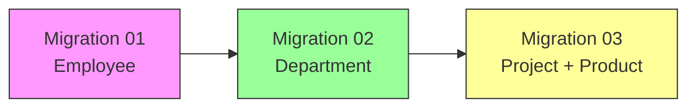
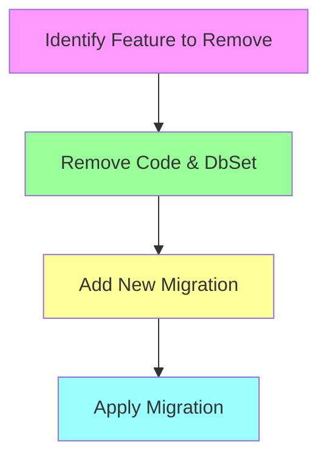

# Understanding Entity Framework Core Migrations

## Table of Contents
- [Introduction](#introduction)
- [Migration Scenarios](#migration-scenarios)
- [Working with Migrations](#working-with-migrations)
- [Best Practices](#best-practices)
- [Common Scenarios and Solutions](#common-scenarios-and-solutions)

## Introduction

This guide demonstrates Entity Framework Core migrations through practical examples, focusing on how to manage database schema changes effectively in a production environment.

## Migration Scenarios

Let's explore different migration scenarios using a simple example:

### Original Employee Class
```csharp
public class Employee {
    public int Id { get; set; }
    public string? Name { get; set; }
    public double Salary { get; set; }
    public int? Age { get; set; }
}
```

### Adding a New Property
```csharp
public class Employee {
    public int Id { get; set; }
    public string? Name { get; set; }
    public double Salary { get; set; }
    public int? Age { get; set; }
    public string? Address { get; set; }  // New property
}
```

## Working with Migrations

### Migration Commands

| Command | Description | Usage |
|---------|-------------|-------|
| `Add-Migration` | Creates a new migration based on model changes | `Add-Migration AddressColumnToEmployee` |
| `Update-Database` | Applies pending migrations to the database | `Update-Database` |
| `Remove-Migration` | Removes the last migration (if not applied) | `Remove-Migration` |
| `Update-Database -Migration` | Rolls back to a specific migration | `Update-Database -Migration "InitialCreate"` |

### Migration Structure

When adding the Address property, the migration will contain:

```csharp
public partial class AddressColumnToEmployee : Migration
{
    protected override void Up(MigrationBuilder migrationBuilder)
    {
        migrationBuilder.AddColumn<string>(
            name: "Address",
            table: "Employees",
            type: "nvarchar(max)",
            nullable: true);
    }

    protected override void Down(MigrationBuilder migrationBuilder)
    {
        migrationBuilder.DropColumn(
            name: "Address",
            table: "Employees");
    }
}
```

## Project Evolution



## Best Practices

1. **Service-Based Migration Strategy**
   - Divide projects into services
   - Each service maintains its own schema/module
   - Plan migrations comprehensively

2. **Rolling Back Changes**
   - Prefer creating new migrations over using Down() methods
   - Remove unwanted code and create a new migration
   - Avoid using `Update-Database` with previous migrations when removing specific features

### Example: Correct Way to Remove Features



## Common Scenarios and Solutions

| Scenario | Incorrect Approach | Correct Approach |
|----------|-------------------|------------------|
| Remove Product class | Roll back Migration 03 | Delete Product class & DbSet, create new migration |
| Remove Department | Update-Database to Migration 01 | Delete Department class & DbSet, create new migration |
| Empty migration check | - | Add-Migration Test (Up will be empty if no changes) |

## Notes for Production

1. Always test migrations in development environment first
2. Back up production database before applying migrations
3. Consider using migration bundles for production deployment
4. Document all migration changes and their impact

## Conclusion

Understanding migrations is crucial for maintaining database schema changes in Entity Framework Core applications. Following these best practices helps ensure smooth database evolution while maintaining data integrity.
